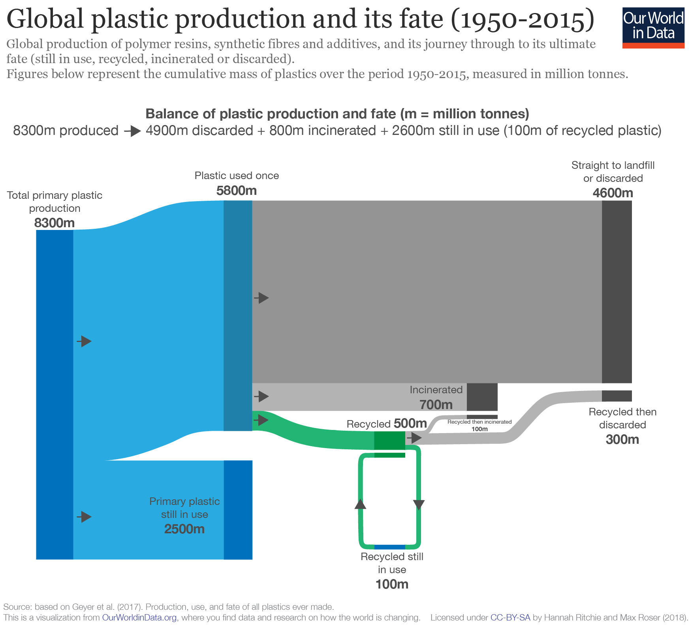
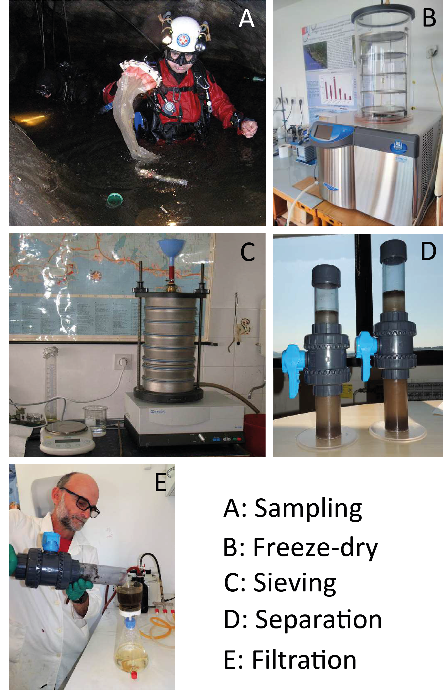

In 1907, the first synthetic plastic, *Bakelite*, was produced. That same year, Otto Krummel published what might be the first stand-alone map of the Marianas Trench, the deepest point on Earth's surface. When plastic started to be produced on industrial scales in the 1950s, the first ascent of Everest was made. A decade later on January 23rd 1960, Jacques Picard and Don Walsh made a [historic first visit](http://www.deepseachallenge.com/the-expedition/1960-dive/) to the black depths of Marianas. In that decade, global plastic production had reached 47 million tonnes in total (8 million in the year 1960). Over 60 years have now passed since then, and the ocean waters into which Picard and Walsh descended have been unquestionably altered by the now nearly 8 billion tonnes of plastic that preside on our planet today.

Pervasive pollution is an overwhelming consequence of the technological advances humanity has made since the Industrial Revolution. Nuclear waste, building materials such as concrete and aluminium, and plastics are now mixed in with sediments across the globe which in time will turn into rocks. The preservation of temporal markers in the rock record (and other planetary archives such as cave stalagmites or polar ice cores) informs our knowledge of Earth's history, and a group of geologists called the 'Anthropocene Working Group' was set up in 2009 to investigate whether we as a species might be responsible for changes so vast that they represent a new epoch in Earth Time. Reviews of the progress of their work are available [here](https://agupubs.onlinelibrary.wiley.com/doi/10.1002/2016EF000379) and [here](http://quaternary.stratigraphy.org/working-groups/anthropocene/), and I also found a useful holistic [webpage](http://www.anthropocene.info/index.php) that delves into socio-economic and earth system trends that define the Anthropocene. A research article detailing the geological cycle of plastics and their use as stratigraphic markers is available [here](https://www.eas.ualberta.ca/wolfe/eprints/Zalasiewicz_Plastics.pdf).

Even to non-rock botherers, however, the degree to which plastics are present in the environment is very clear. It's also no secret among the general public that the fate of plastic products is not as they thought only 10 years or so ago. Contrary to what I was taught in school growing up, I now know plastic can't be recycled efficiently at all: indeed, only around 20% of plastics are recycled today, with the rest being incinerated (releasing greenhouse gases and polluting aerosols, nasty stuff) or floating around us in the atmosphere, biosphere and deep ocean like a smog of judgment. Our World In Data have done a full [analysis](https://ourworldindata.org/plastic-pollution) of plastic pollution with really great graphics, like the one below. 

Microplastics, those plastics that are smaller than 5 mm in size, are a source of heightened concern environmentally due to their ability to be ingested by creatures of almost any size, with potentially severe health consequences for the animal in question. For example, they have been shown to negatively affect the reproductive capabilities of organisms such as [oysters](https://www.pnas.org/content/113/9/2430) after consumption. Significant bodies of research suggest that a major consequence of ingestion of microplastics may be filling or physical alteration of the digestive tract, compromising that animals ability to extract goodness from the food it eats. Additionally, microplastics are able to harbor numerous pathogens and contaminants that remain resident on their surfaces for a long time, heightening their ability to act as carriers for multiple dangerous pollutants. The feedbacks on the wider ecosystem of the remarkably rapid introduction of microplastics are unknown, but are unlikely to be positive in terms of maintaining biodiversity. A very detailed and insightful review of the state of global microplastic research can be found [here](https://agupubs.onlinelibrary.wiley.com/doi/10.1029/2018JC014719). 

Much remains to be understood about microplastic pollution, however, despite the phenomenal amount of study that has begun to occur in this relatively immature field. So far, there has been very limited study of microplastics in the terrestrial environment as opposed to in the oceans, and most of the study of ocean microplastics has focussed on the ocean surface. The exact nature of the 'microplastic cycle' requires a great deal of further study, with sources, sinks and transport mechanisms still not well understood. Furthermore, the exact nature of interactions between microplastics and the environment in which they are deposited remains largely unknown, and understanding this is crucial to limiting the impact of microplastics on drinking water supplies (such as those in karstic groundwater aquifers.) The diagram below highlights ten key challenges awaiting answers from microplastics research.

*Challenges facing the study and reduction of microplastics in the environment, from Hale et al (2020).*

The diagram also highlights the challenges in reducing the impact of microplastics on the environment. Of these, point 8 particularly stood out to me. Microplastics are likely to have contaminated almost every corner of our planet. They have been found in rainwater, in our food... they're everywhere. The feats I referred to in the opening paragraph (the descent into the Marianas Trench and the first ascent of Everest), where the highest and lowest points on the planet were reached, were truly historic moments in exploration, and we still don't know much about our planet's loftiest peaks or darkest depths. It's easy to grasp why: they are very hostile to any form of life and repel efforts by humans to penetrate their secrets. And yet both are parts of our planet which are 'open' to the atmosphere, so any contaminant carried by rainwater or surface water will conceivably have left a mark there (ie microplastics). But there is another kind of environment which is in many ways more remote, despite often being cheaper and easier for humanns to access, about which much less is known: caves. 

Cave passages are eroded within physical rock, whose effect is to shield them from the atmosphere on the surface. These passage networks are often formed by flowing water (and occasionally by other corrosive agents such as sulphuric acid). But, as the hydrological and topographic conditions on the surface change, the water may begin to take a new path and abandon the passage for hundreds of thousands, even millions of years. An unknowable amount of passages like these still remain unmapped, their inhabitants and natural wonders unseen. Such places are surely beyond the all-enveloping extent of microplastic pollution? Well, the short answer is we really don't know for sure. 

*Julian Todd in Silk Road passage, Schwarzmooskogel Hoehle system, Loser Plateau, Austria. This cave passage is at least two million years old and probably [older](http://www.sediment.uni-goettingen.de/staff/dunkl/zips/frisch-et-al-2001.pdf). It is seemingly isolated from inputs from the surface, and thus microplastics. But what if... Photo: Andrew Atkinson.*

The cave environment has not yet been studied scientifically for microplastic contamination. This is despite the fact that karst aquifers supply drinking water to around 20% of the worlds population (in many places they are the only water resource available) and are highly vulnerable to rapid surface contamination from unlikely sources due to their highly complex geometries. In term of groundwater source protection, if a sinkhole becomes polluted on the surface (e.g. by fly tipping or by ingress of agricultural waste products), pollution of the underlying karst aquifer is much more likely. Pollution of karst aquifers by other kinds of contaminants (such as nitrates) is a well-studied and pertinent problem. The EU Water Framework Directive states that not only is groundwater an important source of drinking, irrigation and cooling water, but also its preservation is key to maintenance of surface ecosystems. Caves also hold a unique place in the geoheritage in the regions where they exist, stimulating tourism and economic development in many areas. Thus, research on microplastics in caves not only has intellectual intrigue ('are microplastics *really* everywhere?') but also policy implications. An academic but very readable summary of the state of play in karst research can be found [here](https://sp.lyellcollection.org/content/466/1/1).

Microplastics in soils is another crucial area of future research. Karst soils are unique: the uppermost layer of a karst system, termed 'epikarst', stores water in a separate aquifer which slowly percolates down to the carbonate rocks below, often precipitating calcite in the ceiling of cave passages as stalactites (see a summary of the epikarst [here](https://scholarcommons.usf.edu/cgi/viewcontent.cgi?article=1173&context=ijs). Recharge to the cave from the epikarst is fascinating and much remains to be understood. A question that immediately sprung into my mind when thinking about microplastics was: 'can microplastics be held in the epikarst aquifer, and then transmitted to the cave environment and karst aquifer below?' Is there a way to distinguish microplastics from the epikarst from those brought in by floodwaters etc? Obviously the deposits from each input will be different, but this field is completely new so such basic questions are there to be properly answered.

*A conceptual model of the karst environment, from [Hartmann et al. (2014)](https://agupubs.onlinelibrary.wiley.com/doi/10.1002/2013RG000443).*

The entrances of caves and surface karst depressions (dolines) are often convenient dumping grounds for all kinds of waste and pollutants in rural communities where there may not be regular refuse collection and the impacts of such pollution may not be well understood. This is very likely in countries such as China, Vietnam or Indonesia, where significant karst exists, refuse collection may not and also where many European countries ship their plastic waste to be sorted and then recycled or incinerated. The video below shows a worst-case scenario from a cave in China. But plastic pollution in karst is still an issue across Europe: a recent [enquiry](https://ukcaving.com/board/index.php?topic=26445.msg323525) from me on UKCaving brought up a number of tales of such pollution from others, and I've certainly seen quite a bit of it across Europe myself.

<iframe width="560" height="315" src="https://www.youtube.com/embed/R5ar_JXz6mU" frameborder="0" allow="accelerometer; autoplay; encrypted-media; gyroscope; picture-in-picture" allowfullscreen></iframe>

*Quite a lot of plastic debris in a cave in China. Mark Richardson didn't seem to like the look the toy reindeer gave him. Thanks to Jane Allen for the video. Tim Allen told me that another cave explored on the same trip had plastics incorperated into clastic sediment banks, as has been reported in other terrestrial environments such as rivers.*

So, it would appear that there is considerable scope and demand for research on microplastics in the cave environment. However, I know next to nothing about the ins and outs of microplastic science, so I wanted to find someone that knew more than me to check that my ideas weren't nonsense. A bit of roaming the academic web eventually revealed an [abstract](https://sednet.org/wp-content/uploads/2019/05/N.-Cukrov-Microplastics.pdf) and some [presentation slides](https://sednet.org/wp-content/uploads/2019/05/N.-Cukrov-ppt.pdf), from a group of Croatian researchers and speleologists who had begun to conduct a survey of microplastics in sediments from Croatian caves. They seemed to have a method down to work up the samples (pictures below) and knew a lot more than me, so I sent an email to the lead author, Neven. Amazingly, he replied in a positive vein about possibly collaborating on a project sampling microplastics from caves around Europe. Unsurprisingly, their project has been thrown into a bit of disarray by Covid-19, leaving them with limited lab time to finish processing and analysing samples and collect new ones. However, the idea of comparing cave sites across Europe for microplastic contamination is a strong one with potentially high impact. As Neven said to me: 'I think that now you may find microplastic in any environment.' Only one way to find out...

*Method of microplastic sediment sample processing from presentation of Cukrov et al. at the SedNet 2019 conference.*

The exact methodology that should be employed when undertaking analysis of the microplastics samples remains to be determined, and I will hopefully discuss the options and advantages/disadvantages in a future blog post. Something that I think is crucial, however, is to keep the resources necessary as low-tech and low-cost as possible to allow the whole caving community to contribute to the project. The collection method being used in the figure above is a 'manta net', which is quite common according to [this article](https://www.researchgate.net/publication/322106623_Microplastics_in_freshwater_systems_A_review_on_occurrence_environmental_effects_and_methods_for_microplastics_detection). But, as the article and Hale et al's work makes clear, the best methodology is still not agreed on and deciding upon a suitable method will be one of the key steps in making the research robust and universally applicable.

I'll finish by suggesting some initial questions and possible study sites. Specific questions I think a basic study of microplastics in the cave environment should aim to answer are:

- to what degree are microplastics present in the cave environment, and how abundant are they at different scales?

- what are the sources of microplastic contamination in the cave environment, what kinds of microplastics are present, and how do these sources change depending on the specifics of the site being studied?

- how are microplastics dispersed through particular cave sites, and what can we say about the reasons for any patterns in dispersion that exist (for example, aquifer geometry or the nature of recharge to the cave system)?

- to what degree is the epikarst able to filter microplastic from dripwaters and in what way does the presence of microplastics affect the biological and chemical functioning of the epikarst?

- do cave microplastics harbor pathogens and pollutants?

- have cave biota been affected by microplastics, and if so how?

Initial UK and Irish caving sites that I think would merit from microplastics surveying:

- Easegill Caverns/3 Counties System, North England

- Gaping Gill, Yorkshire

- Sleets Gill Cave, Yorkshire

- Providence Pot/Dow Cave, Yorkshire

- BCRA Cave Monitoring Centre at Poole's Cavern, Buxton

- Wookey Hole/Swildons Hole, Mendip

- Peak Cavern, Derbyshire

- Marble Arch Caves, Fermanagh

- Burren karst, County Clare

- OFD, South Wales

- Agen Allwedd/Daren Cilau, South Wales

- Ogof Draenen, South Wales

- Otter Hole, Forest of Dean (really interesting as next to an estuary...)

It would be great to expand the number of sites studied to other countries, and particularly to cave passages that are more remote than those in the UK to see if microplastics really are everywhere. If we are able to go caving in Austria this year then I would love to sample some of the old passage levels there, so fingers crossed.

If anyone would like to collaborate on such a project, or has any ideas of how it should be designed, please drop me an [email](mailto:robert.watson@ucd.ie) or get in touch on Twitter (link in the bar below). I'm hopeful that there is at least one cave passage on Earth with no microplastics in it!